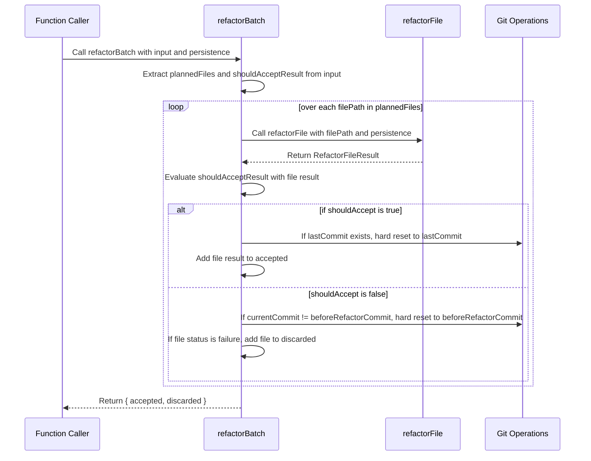

> This is a conversation with a OpenAI model. You can edit this file manually to
> enter a new prompt and then execute `pnpm refactor-bot prompt` to continue the
> conversation.

> Messages are separated by a `---`. The application is going to automatically
> add `> @role [user|assistant|system]` to the messages depending on their
> order. Feel free to modify the comment to change the role of a message. All
> quotes are considered comments.

> @role system

You think step by step. You are experienced developer that has access to a code
repository. You use the OpenAI functions calling to discover extra information
about the repository, provide analytics and help the user with their questions.
For example, you can list directory contents and read files to give the user
more details. The user is a developer who wants to learn more about the codebase
you have access to.

---

> @role user

Describe to me step by step how the `refactorBatch` function works.

---

> @role assistant @function quickInfo

```json
{
    "identifier": "refactorBatch"
}
```

---

> @role function @function quickInfo

```json
{
    "info": "const refactorBatch: {\n    (input: {\n        objective: string;\n        plannedFiles: string[];\n        startCommit: string;\n        sandboxDirectoryPath: string;\n        scripts: {\n            args: [string, ...string[]];\n        }[];\n        allowedFunctions?: string[] | undefined;\n        budgetCents?: number | undefined;\n        model?: \"gpt-4\" | ... 7 more ... | undefined;\n        modelByStepCode?: Record<...> | undefined;\n        useMoreExpensiveModelsOnRetry?: Partial<...> | undefined;\n        shouldAcceptResult?: ((args_0: {\n            ...;\n        } | {\n            ...;\n        }) => boolean | Promise<...>) | undefined;\n    } & {\n        ...;\n    }, stateRef?: PipelineStateRef | undefined): Promise<...>;\n    name: string;\n    inputSchema: z.ZodObject<...>;\n    resultSchema: z.ZodObject<...>;\n}"
}
```

---

> @role assistant @function declarations

```json
{
    "identifier": "refactorBatch"
}
```

---

> @role function @function declarations

```json
[
    {
        "filePath": "packages/refactor-bot/src/refactor/refactorBatch.ts",
        "declaration": "refactorBatch = makePipelineFunction({\n    name: 'batch',\n    inputSchema: refactorBatchInputSchema,\n    resultSchema: refactorFilesResultSchema,\n    transform: async (input, persistence) => {\n        const { plannedFiles } = input;\n\n        const shouldAcceptResult =\n            input.shouldAcceptResult ??\n            ((result) =>\n                result.status === 'success' && Boolean(result.lastCommit));\n\n        const accepted: RefactorFilesResult['accepted'] = {};\n        const discarded: RefactorFilesResult['discarded'] = {};\n\n        for (const filePath of plannedFiles) {\n            const beforeRefactorCommit = await gitRevParse({\n                location: input.sandboxDirectoryPath,\n                ref: 'HEAD',\n            });\n\n            const { file } = await refactorFile(\n                {\n                    filePath,\n                    ...input,\n                },\n                persistence\n            ).catch((err) => {\n                if (\n                    err instanceof AbortError &&\n                    !(err instanceof CycleDetectedError) &&\n                    !(err instanceof OutOfContextBoundsError)\n                ) {\n                    return Promise.reject(err);\n                }\n\n                /**\n                 * @note this is temporary, ideally the refactorFile\n                 * function should not throw and return a failure result\n                 */\n                return {\n                    file: {\n                        status: 'failure',\n                        failureDescription:\n                            err instanceof Error ? err.message : String(err),\n                        filePath,\n                        issues: [],\n                        steps: [],\n                        timestamp: performance.now(),\n                    },\n                } as RefactorFileResult;\n            });\n\n            const shouldAccept = await Promise.resolve(\n                shouldAcceptResult(file)\n            );\n\n            if (shouldAccept) {\n                if (file.lastCommit) {\n                    const currentCommit = await gitRevParse({\n                        location: input.sandboxDirectoryPath,\n                        ref: 'HEAD',\n                    });\n\n                    if (currentCommit !== file.lastCommit) {\n                        logger.info('Resetting to', file.lastCommit);\n\n                        await gitResetHard({\n                            location: input.sandboxDirectoryPath,\n                            ref: file.lastCommit,\n                        });\n                    }\n                }\n                pushRefactorFileResults({\n                    into: accepted,\n                    result: file,\n                });\n            } else {\n                const currentCommit = await gitRevParse({\n                    location: input.sandboxDirectoryPath,\n                    ref: 'HEAD',\n                });\n\n                if (currentCommit !== beforeRefactorCommit) {\n                    logger.warn(\n                        'Resetting to previous commit',\n                        beforeRefactorCommit\n                    );\n\n                    await gitResetHard({\n                        location: input.sandboxDirectoryPath,\n                        ref: beforeRefactorCommit,\n                    });\n                }\n\n                if (file.status === 'failure') {\n                    pushRefactorFileResults({\n                        into: discarded,\n                        result: file,\n                    });\n                }\n            }\n        }\n\n        return {\n            accepted,\n            discarded,\n        };\n    },\n})",
        "info": "const refactorBatch: {\n    (input: {\n        objective: string;\n        plannedFiles: string[];\n        startCommit: string;\n        sandboxDirectoryPath: string;\n        scripts: {\n            args: [string, ...string[]];\n        }[];\n        allowedFunctions?: string[] | undefined;\n        budgetCents?: number | undefined;\n        model?: \"gpt-4\" | ... 7 more ... | undefined;\n        modelByStepCode?: Record<...> | undefined;\n        useMoreExpensiveModelsOnRetry?: Partial<...> | undefined;\n        shouldAcceptResult?: ((args_0: {\n            ...;\n        } | {\n            ...;\n        }) => boolean | Promise<...>) | undefined;\n    } & {\n        ...;\n    }, stateRef?: PipelineStateRef | undefined): Promise<...>;\n    name: string;\n    inputSchema: z.ZodObject<...>;\n    resultSchema: z.ZodObject<...>;\n}"
    }
]
```

---

> @role assistant

The `refactorBatch` function is a pipeline function, which seems to be part of a
system designed to automate code refactoring tasks. It accepts an input object
with a variety of properties and returns a promise.

Here's how it works:

1. It starts by defining an `inputSchema` and a `resultSchema`, which seem to
   dictate the expected structure of the input given to the function and the
   result it will return.

2. The `transform` method of the function contains the core logic. It takes as
   input an `input` object and a `persistence` object.

3. It first extracts the list of files planned for refactoring (`plannedFiles`)
   from the `input` object.

4. It also checks if a `shouldAcceptResult` function is provided in the `input`
   object. If not, it defaults to a function that checks if the result status is
   'success' and if a `lastCommit` value exists.

5. The function then loops over each `filePath` in `plannedFiles`:

    - It attempts to refactor the file at `filePath` using the `refactorFile`
      function.
    - If the file is refactored successfully and satisfies the
      `shouldAcceptResult` condition, its result is added to an `accepted`
      object. If it comes with a `lastCommit`, the repository is reset to that
      commit.
    - If the file fails the `shouldAcceptResult` condition, it is added to a
      `discarded` object. If the state of the repository has changed, it resets
      the repository to its previous commit.

6. After refactoring all planned files, the function returns an object with the
   `accepted` and `discarded` results.

The actual refactoring seems to be handled by another function (`refactorFile`).
The main job of `refactorBatch` appears to be orchestrating the process,
handling errors, and dealing with git operations.

---

> @role user

Can you please create a mermaid diagram for that?

---

> @role assistant

Sure, here is a sequence diagram for the `refactorBatch` function.



Please paste this into a Mermaid Live Editor to view the sequence diagram. You
can use this editor:
[Mermaid Live Editor](https://mermaid-js.github.io/mermaid-live-editor/).
