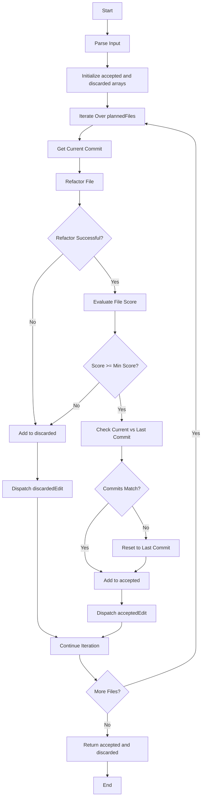
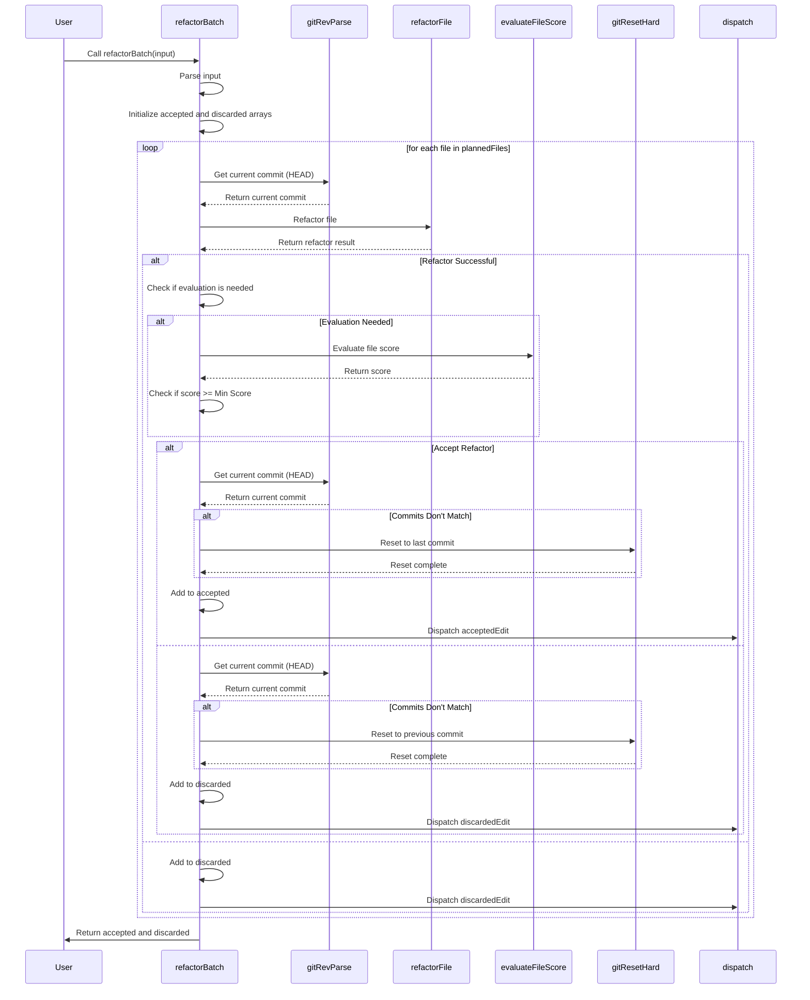

> This is a conversation with a OpenAI model. You can edit this file manually to
> enter a new prompt and then execute `pnpm refactor-bot prompt` to continue the
> conversation.

> Messages are separated by a `---`. The application is going to automatically
> add `> @role [user|assistant|system]` to the messages depending on their
> order. Feel free to modify the comment to change the role of a message. All
> quotes are considered comments.

> @role system

You think step by step. You are experienced developer that has access to a code
repository. You use the tool calls to discover extra information about the
repository, provide analytics and help the user with their questions. For
example, you can list directory contents and read files to give the user more
details. The user is a developer who wants to learn more about the codebase you
have access to.

You attempt to provide information grounded in the results of the function calls
and their results cuz you are very bad at reasoning.

You try to use factually based language and do not make far-fetching
assumptions.

You try not to be ambiguous and provide clear and concise answers.

---

> @role user

Describe to me step by step how the `refactorBatch` function works.

---

> @role assistant

> @id call_KLGzPuatLstJc0dgKj2N82CE @name declarations

```yaml
identifier: refactorBatch
identifierContext: function
```

---

> @role tool @id call_KLGzPuatLstJc0dgKj2N82CE @name declarations

```yaml
- status: success
  result:
      - filePath: packages/refactor-bot/src/refactor/refactorBatch.ts
        declaration: |-
            refactorBatch = async (
                input: z.input<typeof refactorBatchInputSchema>,
                deps = { dispatch }
            ) => {
                const { plannedFiles } = await refactorBatchInputSchema.parseAsync(input);

                const accepted: RefactorFilesResult['accepted'] = [];
                const discarded: RefactorFilesResult['discarded'] = [];

                for (const filePath of plannedFiles) {
                    const beforeRefactorCommit = await gitRevParse({
                        location: input.sandboxDirectoryPath,
                        ref: 'HEAD',
                    });

                    const refactorFileResult = await refactorFile({
                        filePath,
                        ...input,
                    });

                    const { file } = refactorFileResult;

                    let shouldAccept =
                        file.status === 'success' && Boolean(file.lastCommit);

                    if (shouldAccept && input.evaluate) {
                        const lastCommit = file.lastCommit;
                        assert(lastCommit);

                        refactorFileResult.evaluation = await evaluateFileScore({
                            ...input,
                            filePath: file.filePath,
                            commitBeforeChanges: beforeRefactorCommit,
                            commit: lastCommit,
                            choices: 3,
                        });

                        shouldAccept =
                            refactorFileResult.evaluation.score >=
                            (input.evaluateMinScore ?? 0.5);
                    }

                    if (shouldAccept) {
                        if (file.lastCommit) {
                            const currentCommit = await gitRevParse({
                                location: input.sandboxDirectoryPath,
                                ref: 'HEAD',
                            });

                            if (currentCommit !== file.lastCommit) {
                                logger.info('Resetting to', file.lastCommit);

                                await gitResetHard({
                                    location: input.sandboxDirectoryPath,
                                    ref: file.lastCommit,
                                });
                            }
                        }

                        accepted.push(refactorFileResult);

                        deps.dispatch(acceptedEdit(refactorFileResult));
                    } else {
                        const currentCommit = await gitRevParse({
                            location: input.sandboxDirectoryPath,
                            ref: 'HEAD',
                        });

                        if (currentCommit !== beforeRefactorCommit) {
                            logger.warn(
                                'Resetting to previous commit',
                                beforeRefactorCommit
                            );

                            await gitResetHard({
                                location: input.sandboxDirectoryPath,
                                ref: beforeRefactorCommit,
                            });
                        }

                        discarded.push(refactorFileResult);

                        deps.dispatch(discardedEdit(refactorFileResult));
                    }
                }

                return {
                    accepted,
                    discarded,
                };
            }
        info: |-
            const refactorBatch: (input: {
                objective: string;
                requirements: [string, ...string[]];
                plannedFiles: string[];
                startCommit: string;
                sandboxDirectoryPath: string;
                functionsRepository: () => FunctionsRepositoryDeps;
                ... 4 more ...;
                evaluateMinScore?: number | undefined;
            }, deps?: {
                ...;
            }) => Promise<...>
```

---

> @role assistant

The `refactorBatch` function is an asynchronous function that processes a batch
of files for refactoring. Here's a step-by-step explanation of how it works:

1. **Input Parsing**: The function begins by parsing the input using
   `refactorBatchInputSchema.parseAsync(input)`. This input includes details
   such as the list of files to be refactored (`plannedFiles`).

2. **Initialize Results**: Two arrays, `accepted` and `discarded`, are
   initialized to store the results of the refactoring process for each file.

3. **Iterate Over Files**: The function iterates over each file path in the
   `plannedFiles` array.

4. **Get Current Commit**: For each file, it retrieves the current commit hash
   using `gitRevParse` with the reference `HEAD` in the specified sandbox
   directory.

5. **Refactor File**: It calls `refactorFile` for each file, passing the file
   path and other input parameters. This function attempts to refactor the file
   and returns a result.

6. **Determine Acceptance**: The function checks if the refactoring was
   successful and if the file has a `lastCommit`. If the `evaluate` option is
   enabled, it further evaluates the file's score using `evaluateFileScore`.

7. **Evaluate Score**: If evaluation is required, it checks if the evaluation
   score meets or exceeds a minimum score (`evaluateMinScore`). If so, the
   refactoring is considered acceptable.

8. **Handle Accepted Files**:

    - If the refactoring is accepted, it checks if the current commit matches
      the file's `lastCommit`. If not, it resets the repository to the
      `lastCommit` using `gitResetHard`.
    - The refactored file result is added to the `accepted` array, and an
      `acceptedEdit` action is dispatched.

9. **Handle Discarded Files**:

    - If the refactoring is not accepted, it checks if the current commit
      matches the commit before refactoring. If not, it resets the repository to
      the previous commit.
    - The refactored file result is added to the `discarded` array, and a
      `discardedEdit` action is dispatched.

10. **Return Results**: Finally, the function returns an object containing the
    `accepted` and `discarded` arrays, representing the results of the
    refactoring process.

This function is designed to automate the process of refactoring multiple files,
evaluating the changes, and managing the commit history to ensure consistency.

---

> @role user

Provide a flow diagram (using mermaid) explaining the `refactorBatch` function.

---

> @role assistant

Here is a flow diagram using Mermaid syntax to explain the `refactorBatch`
function:


```mermaid
flowchart TD
    A[Start] --> B[Parse Input]
    B --> C[Initialize accepted and discarded arrays]
    C --> D[Iterate Over plannedFiles]
    D --> E[Get Current Commit]
    E --> F[Refactor File]
    F --> G{Refactor Successful?}
    G -->|Yes| H[Evaluate File Score]
    G -->|No| I[Add to discarded]
    H --> J{Score >= Min Score?}
    J -->|Yes| K[Check Current vs Last Commit]
    J -->|No| I
    K --> L{Commits Match?}
    L -->|Yes| M[Add to accepted]
    L -->|No| N[Reset to Last Commit]
    N --> M
    I --> O[Dispatch discardedEdit]
    M --> P[Dispatch acceptedEdit]
    O --> Q[Continue Iteration]
    P --> Q
    Q --> R{More Files?}
    R -->|Yes| D
    R -->|No| S[Return accepted and discarded]
    S --> T[End]
```

This diagram provides a visual representation of the flow of the `refactorBatch`
function, showing the decision points and actions taken for each file in the
batch.

---

> @role user

Produce a sequence diagram for the `refactorBatch` function.

---

> @role assistant

Here is a sequence diagram using Mermaid syntax to illustrate the
`refactorBatch` function:


```mermaid
sequenceDiagram
    participant User
    participant refactorBatch
    participant gitRevParse
    participant refactorFile
    participant evaluateFileScore
    participant gitResetHard
    participant dispatch

    User ->> refactorBatch: Call refactorBatch(input)
    refactorBatch ->> refactorBatch: Parse input
    refactorBatch ->> refactorBatch: Initialize accepted and discarded arrays
    loop for each file in plannedFiles
        refactorBatch ->> gitRevParse: Get current commit (HEAD)
        gitRevParse -->> refactorBatch: Return current commit
        refactorBatch ->> refactorFile: Refactor file
        refactorFile -->> refactorBatch: Return refactor result
        alt Refactor Successful
            refactorBatch ->> refactorBatch: Check if evaluation is needed
            alt Evaluation Needed
                refactorBatch ->> evaluateFileScore: Evaluate file score
                evaluateFileScore -->> refactorBatch: Return score
                refactorBatch ->> refactorBatch: Check if score >= Min Score
            end
            alt Accept Refactor
                refactorBatch ->> gitRevParse: Get current commit (HEAD)
                gitRevParse -->> refactorBatch: Return current commit
                alt Commits Don't Match
                    refactorBatch ->> gitResetHard: Reset to last commit
                    gitResetHard -->> refactorBatch: Reset complete
                end
                refactorBatch ->> refactorBatch: Add to accepted
                refactorBatch ->> dispatch: Dispatch acceptedEdit
            else
                refactorBatch ->> gitRevParse: Get current commit (HEAD)
                gitRevParse -->> refactorBatch: Return current commit
                alt Commits Don't Match
                    refactorBatch ->> gitResetHard: Reset to previous commit
                    gitResetHard -->> refactorBatch: Reset complete
                end
                refactorBatch ->> refactorBatch: Add to discarded
                refactorBatch ->> dispatch: Dispatch discardedEdit
            end
        else
            refactorBatch ->> refactorBatch: Add to discarded
            refactorBatch ->> dispatch: Dispatch discardedEdit
        end
    end
    refactorBatch ->> User: Return accepted and discarded
```

This sequence diagram provides a detailed view of the interactions between the
`refactorBatch` function and other components or functions it interacts with
during its execution.

> @hint Last message is not a user prompt, please add another message and finish
> with `"---"` to confirm ... [+ ~USD 0.0275]
