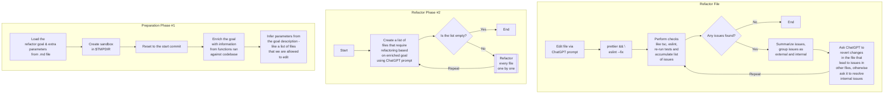

# refactor-bot internal workings

Here are steps that the CLI takes to execute the refactor:

```mermaid
graph TD;
  subgraph Refactor File
    F1["Edit file via
        ChatGPT prompt"];

    F1 --> F2["prettier && \
               eslint --fix"]

    F2 --> F3["Perform checks
               like tsc, eslint,
               re-run tests and
               accumulate list
               of issues"]

    F3 --> F4{"Any issues found?"}
    F4 --> |No| FEnd[End]
    F4 --> |Yes| F5["Summarize issues,
               group issues as
               external and internal"]

    F5 --> F6["Ask ChatGPT to
               revert changes
               in the file that
               lead to issues in
               other files, otherwise
               ask it to resolve
               internal issues"]

    F6 --> |Repeat| F3
  end

  subgraph Refactor Phase #2
    Start --> F["Create a list of
            files that require
            refactoring based
            on enriched goal
            using ChatGPT prompt"];

    F --> G{"Is the list empty?"};
    G -->|Yes| End[End];
    G -->|No| K[["Refactor
            every file
            one by one"]];
    K -->|Repeat| F;
  end

  subgraph Preparation Phase #1
    A["Load the
      refactor goal & extra parameters
      from .md file"] --> B["Create sandbox
                           in $TMPDIR"];
    B --> C[Reset to the start commit];
    C --> D["Enrich the goal
            with information
            from functions ran
            against codebase"];
    D --> E["Infer parameters from
            the goal description -
            like a list of files
            that we are allowed
            to edit"];
  end
```
