# refactor-bot

`refactor-bot` is a CLI for automated code refactoring using OpenAI's LLMs.

Based on the goal provided by the user the CLI will use the OpenAI API to
generate a plan for the refactoring, and refactor one file at a time using "Plan
and Execute" technique, at the same time making sure the code still compiles and
passes linting and tests.

The difference between `refactor-bot` and other tools is that it provides rich
functions API based on `ts-morph` that allows it to extract TypeScript specific
information from the codebase.

## Installation

```
git clone git@github.com:zaripych/refactor-bot.git
```

```
pnpm install
cd /path/to/your/project
pnpm add /path/to/refactor-bot
pnpm add tsx                    # <- at the moment tsx is required for running TypeScript directly, we can tsc/bundle the refactor-bot later, if it works
pnpm refactor-bot --help
```

## Usage

Create `.env` file in current directory:

```
OPENAI_API_KEY="your-key"
```

Supports commands at the moment:

```sh
pnpm refactor-bot <command>

Commands:
  pnpm refactor-bot prompt      Sends a prompt to the ChatGPT API to generate a
                                response
  pnpm refactor-bot refactor    Performs a refactoring using Plan and Execute te
                                chnique
  pnpm refactor-bot completion  generate completion script

Options:
  --help     Show help                                                 [boolean]
  --version  Show version number                                       [boolean]
```

## Refactor

```sh
➜  pnpm refactor-bot refactor

Performs a refactoring using Plan and Execute technique

Options:
  --help     Show help                                                 [boolean]
  --version  Show version number                                       [boolean]
  --name     Name of the refactoring to run                             [string]
  --id       Unique id of the refactoring that was previously run but didn't fin
             ish to start from last successful point                    [string]
```

At first it will create a file for you with description of the refactor. Open
the file, edit it in your editor providing as much relevant information as you
think is needed, then rerun the command.

For an example,
[have a look here](https://github.com/zaripych/refactor-bot/blob/5374a8381edb5b7adb431ff4847f826872221756/.refactor-bot/refactors/replace-read-file-sync/goal.md#L9).

Here are steps that the CLI takes to execute the refactor:

```mermaid
graph TD;
  subgraph Refactor File
    F1["Edit file via
        ChatGPT prompt"];

    F1 --> F2["prettier && \
               eslint --fix"]

    F2 --> F3["Perform checks
               like tsc, eslint,
               re-run tests and
               accumulate list
               of issues"]

    F3 --> F4{"Any issues found?"}
    F4 --> |No| FEnd[End]
    F4 --> |Yes| F5["Summarize issues,
               group issues as
               external and internal"]

    F5 --> F6["Ask ChatGPT to
               revert changes
               in the file that
               lead to issues in
               other files, otherwise
               ask it to resolve
               internal issues"]

    F6 --> |Repeat| F3
  end

  subgraph Refactor Phase #2
    Start --> F["Create a list of
            files that require
            refactoring based
            on enriched goal
            using ChatGPT prompt"];

    F --> G{"Is the list empty?"};
    G -->|Yes| End[End];
    G -->|No| K[["Refactor
            every file
            one by one"]];
    K -->|Repeat| F;
  end

  subgraph Preparation Phase #1
    A["Load the
      refactor goal & extra parameters
      from .md file"] --> B["Create sandbox
                           in $TMPDIR"];
    B --> C[Reset to the start commit];
    C --> D["Enrich the goal
            with information
            from functions ran
            against codebase"];
    D --> E["Infer parameters from
            the goal description -
            like a list of files
            that we are allowed
            to edit"];
  end
```



Refactoring is considered a success if none of the changed files lead to
TypeScript or eslint issues and all affected tests pass.

After refactoring is complete, you will be presented with a report.

Refactoring will not change any files in your local repository and you will be
asked to merge the changes yourself.

At the moment the refactoring is performed in a way that doesn't allow module
interface to change. This means that the type that represents all exported
members of a file will not change as a result of the refactoring. This is done
to ensure that the refactoring is not going to break the codebase. This is
likely the most valuable use case, as it is more likely to result in a success.
Other options are being considered.

It's likely refactoring might fail for one reason or the other. This could
happen for following reasons:

-   Pre-requisites and expectations about the repository are not met by the CLI,
    see expectations section below
-   The OpenAI model is not capable of performing the refactoring either due to
    the model limitations or lack of proper description
-   There is a bug in the refactor-bot

In any case, the CLI was built in a way that it can reproduce all the successful
steps it had done during previous run without starting from scratch, as long as
we know the "refactor-run-id". So if you run the CLI again with the same `--id`
it will start from the last successful step.

Use `LOG_LEVEL=debug` environment variable to see more information about what's
happening.


## Expectations

-   Source code is TypeScript
-   `git` for version control
-   `prettier` for code formatting
-   `VSCode` as editor (optional)
-   You have `glow` installed and available in your `PATH` for formatting
    `markdown` in terminals (optional)

## Prompt

The `prompt` command allows you to test the functions API we provide to the
ChatGPT and see what kind of information it can extract from the codebase.

At the moment the cli is not capable of aggregating information.

```sh
➜  pnpm refactor-bot prompt --watch
? Select a file where the conversation is going to be stored › - Use arrow-keys. Return to submit.
❯   example-1
    example-2
    New conversation...
```

Select a file, and then you will be prompted to enter a message using your
editor. Save the message with `---` at the end to send it.

See example conversation at
[`.refactor-bot/prompts/example-1.md`](.refactor-bot/prompts/example-1.md).

## Roadmap

Currently working on `refactor` command, which will allow you to perform
refactoring.

-   [x] tested using `prompt` command whether the approach is going to work
-   [x] implementing initial version of the `refactor` command via "Plan and
        Execute" approach
-   [x] provide documentation on the approach and what should be expected from
        the `refactor` command
-   [ ] ability to create pull requests in GitHub for both successful
        refactoring and discarded commits with issues
-   [ ] as every source code repository can be very different provide a `doctor`
        command to help diagnose setup issues and generally make `refactor` and
        `prompt` smarter aiming for no-config and automatic
        discovery/configuration

## Privacy and Security

If you are concerned about privacy, consider using "business" account with
OpenAI. Read their license agreement to understand how they can use the data we
send there.

Otherwise, the use of the provided tools here is fully at your own risk. Ensure
there are no secrets available to the bot in your projects directory or in
environment variables so nothing can be leaked accidentally. Minimum precautions
have been made so far to safeguard from accidental leaks as this is still just a
POC.

### How a leak could occur in theory?

We use `ts-morph` to get access to the source code, which uses `TypeScript`
compiler, which can read files in the repository. So if your source code has any
secrets directly in code - they might end up being sent to OpenAI API.

### Other external services

We do not use other external services at the moment other than OpenAI API.
